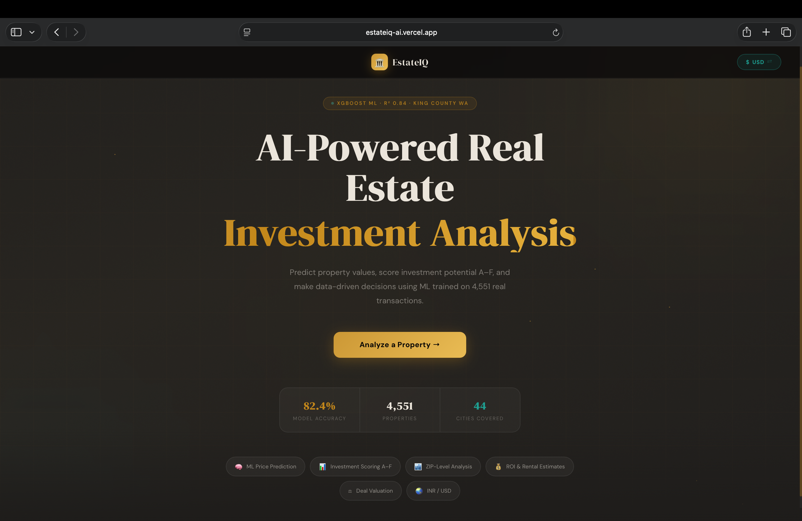
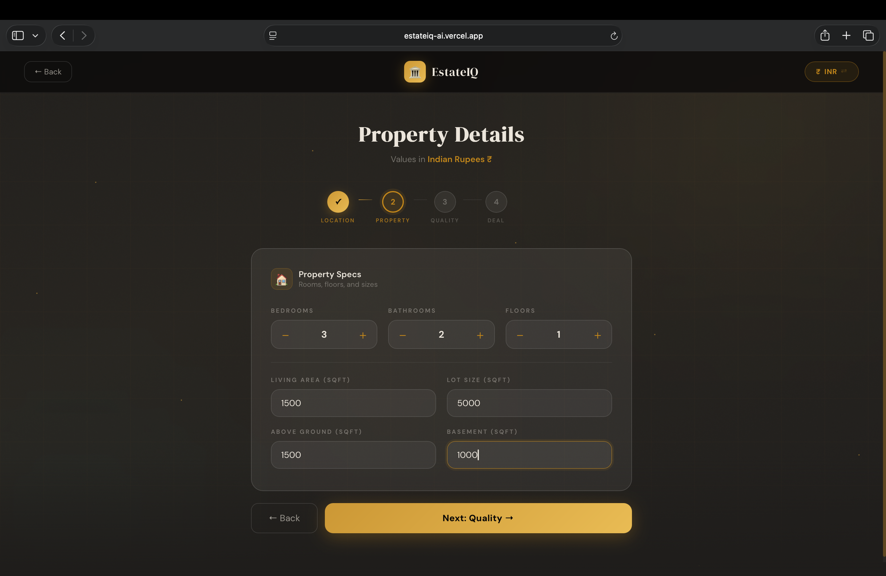
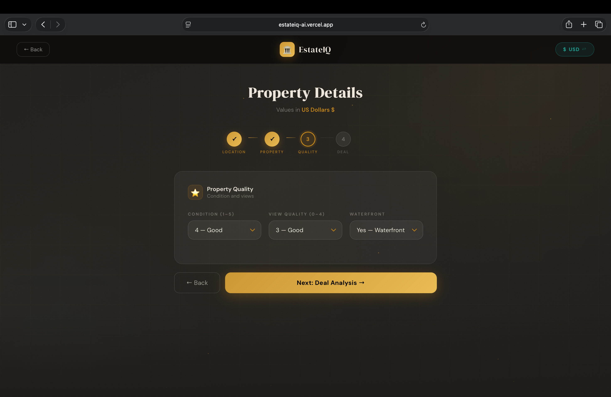
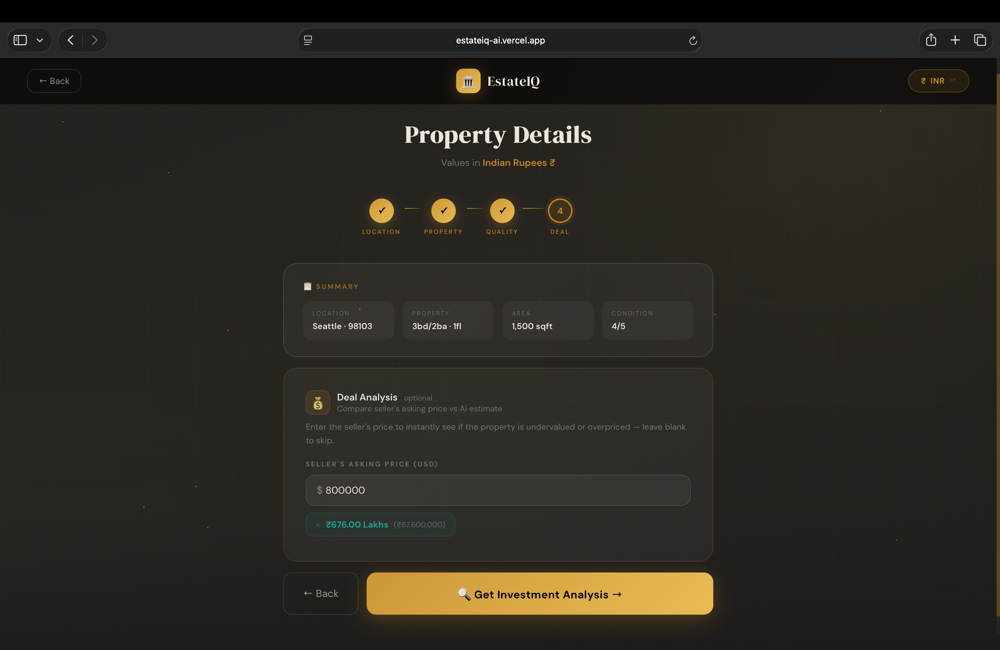
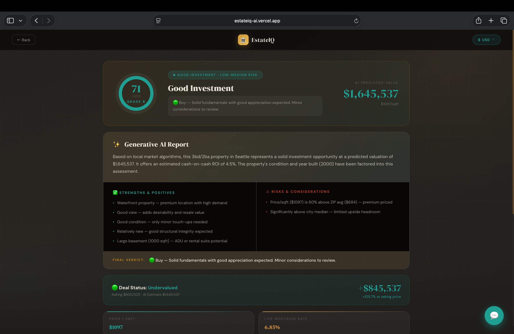
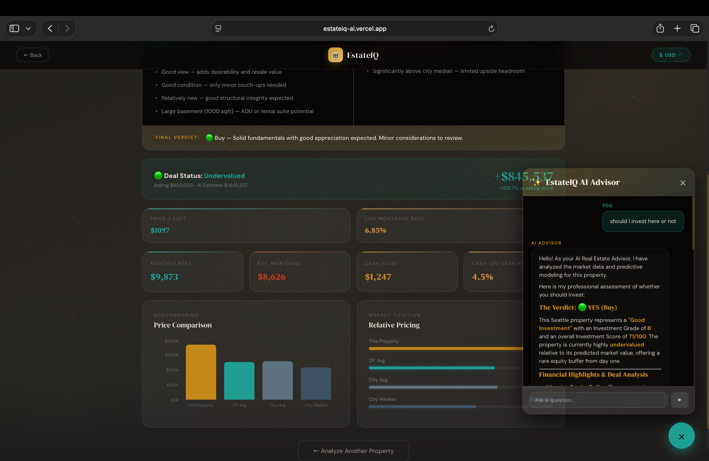
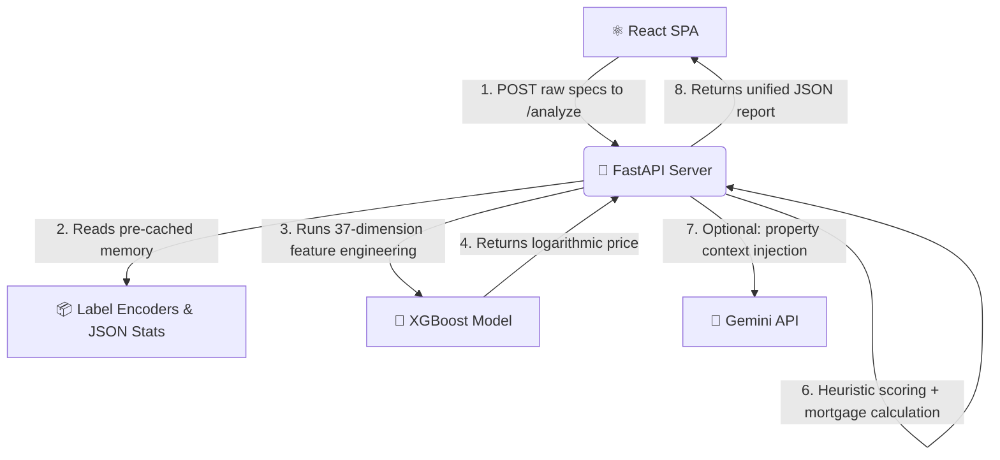

<div align="center">



<br><br>

# 🏛️ EstateIQ

**AI-Powered Real Estate Investment Analyzer**

[](LICENSE)
[](https://python.org)
[](https://react.dev)
[](https://fastapi.tiangolo.com)
[](https://xgboost.readthedocs.io)
[](https://www.docker.com)
[](https://estateiq-ai.vercel.app)
[](https://YOUR-APP.onrender.com)

> Instantly evaluate any real estate deal — predict fair market value, grade investment potential (A–F), and get AI-generated insights in seconds.

| | URL |
|---|---|
| 🌐 **Frontend** | [estateiq-ai.vercel.app](https://estateiq-ai.vercel.app) |
| ⚙️ **Backend API** | [YOUR-APP.onrender.com](https://YOUR-APP.onrender.com) |
| 📄 **Swagger Docs** | [YOUR-APP.onrender.com/docs](https://YOUR-APP.onrender.com/docs) |

### **[🔗 Live Demo](https://estateiq-ai.vercel.app)** &nbsp;·&nbsp; **[📖 Technical Docs](UI_UX_ANALYSIS.md)** &nbsp;·&nbsp; **[⭐ Star this repo](https://github.com/Shivam-0212/estateiq-ai)**

</div>

---

## 📋 Table of Contents

- [Project Highlights](#-project-highlights)
- [Overview](#-overview)
- [Screenshots](#-screenshots)
- [Key Features](#-key-features)
- [Architecture](#-architecture)
- [Tech Stack](#-tech-stack)
- [ML Model Performance](#-ml-model-performance)
- [Getting Started](#-getting-started)
- [Project Structure](#-project-structure)
- [Deal Analysis Logic](#-deal-analysis-logic)
- [Known Limitations](#-known-limitations)
- [Future Roadmap](#-future-roadmap)
- [License](#-license)

---

## 🏅 Project Highlights

- ✅ Built a full-stack ML application using **React**, **FastAPI**, and **XGBoost**
- 📊 Achieved **R² = 0.8244** on real estate price prediction (King County, WA)
- 🤖 Integrated **Gemini AI** for contextual, property-specific natural language analysis
- 🚀 Deployed frontend on **Vercel** and backend API on **Render**
- 🐳 Containerized the full stack using **Docker** and **docker-compose**

---

## 🎯 Overview

**EstateIQ** is a full-stack ML web application that solves a real problem: real estate investors and homebuyers waste hours on manual comparable analysis (*"comps"*) or rely purely on gut feeling to decide if a deal is fair.

EstateIQ automates this entirely by combining a **predictive XGBoost model** (82.4% R²) with a **deterministic expert scoring engine** to return:

- 📈 **Predicted Fair Market Value** — adjusted for modern market appreciation
- 🏆 **Investment Grade (A–F)** — weighted across condition, location, and deal value
- 💰 **Financial Projections** — estimated rent, Cash-on-Cash ROI, and mortgage payments
- 🤖 **AI Property Advisor** — Gemini-powered chatbot with property-specific context

**Target Users:** Real estate investors, homebuyers, wholesalers, and agents who want quantitative deal analysis in seconds — not days.

---

## 📸 Screenshots

<details open>
<summary><strong>🖼️ View Full UI Gallery</strong></summary>

<br>

**🏠 Hero Landing Page**


<br>

**📍 Step 1 — Location Selection**


<br>

**📐 Step 2 — Property Specifications**


<br>

**🔧 Step 3 — Property Quality & Condition**


<br>

**💲 Step 4 — Deal Analysis Input**


<br>

**📊 Step 5 — Investment Dashboard**


<br>

**🤖 AI Property Advisor Chatbot**


</details>

---

## ✨ Key Features

| Feature | Description |
|---|---|
| 🔮 **Instant Valuation** | XGBoost model returns real-time property valuations |
| 🏆 **Investment Grading** | Holistic A–F score based on 6+ weighted factors |
| 💰 **Financial Projections** | Rent estimates, mortgage amortization & Cash-on-Cash ROI |
| 🤖 **AI Chat Advisor** | Gemini-powered chatbot with full property-specific context |
| 📊 **Market Benchmarking** | Compares your property vs. ZIP code and city-level averages |
| 💱 **USD ↔ INR Toggle** | Instant full-UI currency conversion at the click of a button |
| 🐳 **Docker Support** | One-command full-stack deployment with `docker-compose up` |
| ⚡ **Low-Latency Inference** | All models pre-loaded at startup — zero file I/O per request |

---

## 🗺️ Architecture

EstateIQ uses a **decoupled Client-Server architecture** optimized for low-latency inference. All heavy models and pre-computed JSON stats load once into memory at startup via FastAPI's `lifespan` context — eliminating file I/O on every request.



**Request flow inside `/analyze`:**
1. **Validate** → Pydantic strictly types all incoming property fields
2. **Engineer** → Reconstructs the 37-feature vector used during training
3. **Encode** → Converts city/ZIP strings to integers via `.pkl` label encoders
4. **Predict** → XGBoost outputs the log-price; `math.expm1()` reverses it
5. **Adjust** → Applies a `1.95×` multiplier for post-2014 market appreciation
6. **Score** → Expert system calculates investment grade, ROI, and mortgage
7. **Narrate** → Gemini API compiles an AI insight report
8. **Return** → Full JSON response back to the React dashboard

---

## 🛠️ Tech Stack

### Frontend

| Technology | Purpose |
|---|---|
| **React 18 + Vite** | SPA framework with HMR and optimized production builds |
| **Vanilla CSS** | Custom dark-mode design system — no utility-class overhead |
| **Axios** | Promise-based REST API communication |
| **Recharts** | Responsive, interactive market comparison bar charts |
| **React-Markdown** | Renders AI advisor responses with full Markdown formatting |

### Backend

| Technology | Purpose |
|---|---|
| **FastAPI (Python)** | Async REST API with auto-generated Swagger UI at `/docs` |
| **XGBoost (`XGBRegressor`)** | Core gradient-boosted ML regression model |
| **Scikit-Learn** | Label encoding and train/test split pipeline |
| **Pandas / NumPy** | Data processing, aggregation & log transforms |
| **Gemini API** | Generative AI for property insights and the chatbot advisor |

### DevOps & Data

| Technology | Purpose |
|---|---|
| **Docker + docker-compose** | Multi-container orchestration via bridge network |
| **Pickle (`.pkl`)** | Serialized model and encoder storage |
| **JSON files** | Pre-computed city/ZIP market stats — no SQL database needed |
| **Vercel** | Frontend CI/CD deployment |
| **Render** | Backend API hosting |

---

## 📊 ML Model Performance

Trained on the **[King County House Sales dataset](https://www.kaggle.com/datasets/harlfoxem/housesalesprediction)** (Kaggle). The target variable (`price`) is right-skewed due to luxury outliers, so it is normalized with `np.log1p()` before training and reversed with `math.expm1()` at inference.

| Metric | Value | What it means |
|---|---|---|
| **R² Score** | `0.8244` | Explains **82.4%** of all price variance — strong for tabular RE data |
| **MAPE** | `16.1%` | Average prediction within **16.1%** of actual sale price |
| **MAE** | `$82,906` | Average absolute dollar error |
| **RMSE** | `$149,789` | Higher than MAE due to heavy outlier penalty |

**Model Hyperparameters:** `n_estimators=400` · `learning_rate=0.04` · `max_depth=6` · `subsample=0.85`

**Notable engineered features (37 total):**
- `house_age`, `years_since_reno` — temporal decay modeling
- `sqft_x_condition`, `waterfront_x_view` — interaction terms (large + poor ≠ large + excellent)
- `bath_per_bed`, `sqft_ratio` — luxury and lot-use proportions
- `zip_avg_price`, `city_avg_ppsf` — pre-computed geographical target encoding (no live DB queries)

---

## 🚀 Getting Started

### Prerequisites

- Python `3.9+`
- Node.js `18+`
- Docker & Docker Compose *(optional, for Option B)*

---

### Option A — Manual Setup

**1. Start the FastAPI Backend**

```bash
cd backend
python -m venv venv
source venv/bin/activate      # Windows: venv\Scripts\activate
pip install -r requirements.txt
uvicorn main:app --reload
```

> ✅ API live at `http://127.0.0.1:8000`
> 📄 Swagger docs at `http://127.0.0.1:8000/docs`

**2. Start the React Frontend**

```bash
cd frontend
npm install
npm run dev
```

> ✅ App live at `http://localhost:5173`

---

### Option B — Docker (Recommended)

```bash
# From the project root — boots everything in one command
docker-compose up --build
```

| Service | URL |
|---|---|
| React Frontend | `http://localhost:80` |
| FastAPI Backend | `http://localhost:8000` |
| Swagger UI | `http://localhost:8000/docs` |

> 💡 Bind your `GEMINI_API_KEY` in `.env` before running to enable the AI advisor chatbot.

---

## 📁 Project Structure

```
estateiq-ai/
├── docker-compose.yml              # Orchestrates multi-container environment
├── UI_UX_ANALYSIS.md               # Deep-dive architectural documentation
├── assets/                         # Screenshots used in this README
│
├── backend/                        # Python / FastAPI ML inference server
│   ├── main.py                     # API gateway, scoring engine & chatbot endpoint
│   ├── train.py                    # Feature engineering + XGBoost training pipeline
│   ├── test_split.py               # Dataset split utility
│   ├── Dockerfile
│   ├── requirements.txt
│   ├── data.csv                    # King County, WA historical transactions
│   ├── model.pkl                   # Serialized XGBoost model
│   ├── label_encoder.pkl           # City name → integer encoder
│   ├── zip_encoder.pkl             # ZIP code → integer encoder
│   ├── city_stats.json             # Pre-computed city-level price averages
│   ├── zip_stats.json              # Pre-computed ZIP-level price averages
│   └── services/
│       └── api_integrations.py     # Property data and AI service integration utilities
│
└── frontend/                       # React SPA
    ├── vite.config.js
    ├── package.json
    └── src/
        ├── App.jsx                 # State machine: home → wizard → results dashboard
        ├── App.css                 # Component-level styles
        └── index.css              # Global CSS variables, typography & resets
```

---

## 🏆 Deal Analysis Logic

The `compute_investment_score()` function acts as a **heuristic expert system** layered on top of the ML prediction. It grades the *deal*, not just the *property*.

| Factor | Score Impact |
|---|---|
| Baseline | `50 / 100` |
| Waterfront property | `+12` |
| View rating (max 4) | up to `+10` |
| Excellent condition (5/5) | `+10` |
| Poor condition — CAPEX risk | `−14` |
| PPSF significantly below ZIP average | up to `+15` |
| Property undervalued vs. asking price | `+10` |

**Grade Scale:** &nbsp; `A ≥ 80` &nbsp;·&nbsp; `B ≥ 65` &nbsp;·&nbsp; `C ≥ 50` &nbsp;·&nbsp; `D ≥ 35` &nbsp;·&nbsp; `F < 35`

**Undervalued check:** If the model's predicted price exceeds the user's asking price by more than `$5,000`, the deal is flagged as **Undervalued** — representing instant equity for the buyer.

---

## ⚠️ Known Limitations

| Limitation | Details |
|---|---|
| 📅 **Temporal Drift** | Dataset dates to 2014; a fixed `1.95×` multiplier approximates modern values but isn't a live feed |
| 🗺️ **Geographic Bias** | Trained exclusively on King County, WA — predictions for other states will be unreliable |
| 💹 **Static Rent Yield** | Uses a flat `0.6%` gross yield rule; real yields vary by neighborhood, class, and interest rates |
| 📷 **No Visual Analysis** | Cannot assess property photos or parse MLS text descriptions for quality signals |

---

## 🔮 Future Roadmap

- [ ] **Live Data Integration** — Hook up Zillow API / MLS feeds for real-time comps and retraining
- [ ] **Ensemble Modeling** — Stack XGBoost + LightGBM + CatBoost for lower MAPE
- [ ] **Computer Vision** — Score property photos with a CNN to catch finishes and condition
- [ ] **Geospatial Features** — Distance to transit, schools & downtown via Google Maps API
- [ ] **User Accounts** — JWT/OAuth authentication with saved deal history and portfolio tracking
- [ ] **Cloud Deployment** — AWS ECS or Google Cloud Run with a full CI/CD pipeline

---

## 📄 License

Distributed under the **MIT License**. See [`LICENSE`](LICENSE) for full details.

---

<div align="center">

Made with ❤️ by **[Shivam](https://github.com/Shivam-0212)**

<br>

[](https://estateiq-ai.vercel.app)
&nbsp;
[](https://github.com/Shivam-0212/estateiq-ai)

</div>
